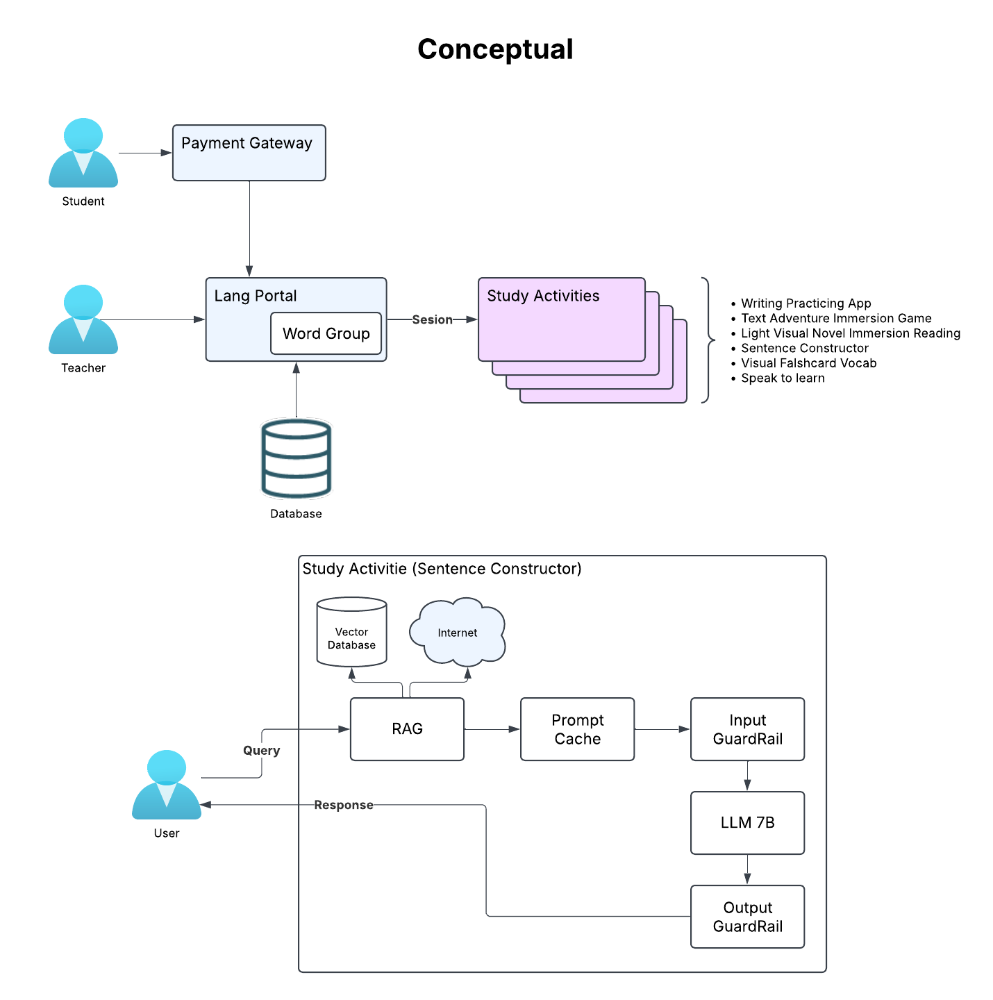

# GenAI Architecture

## Business Requirements

- **Language Translation and Assistance:** Develop AI-driven tools to provide accurate translations and language assistance, catering to user proficiency and specific goals.
- **Interactive Learning Modules:** Offer interactive exercises and study activities that adapt to the user's learning pace, enhancing engagement and effectiveness.
- **User Progress Analytics:** Implement detailed analytics to monitor user progress, identify strengths, and highlight areas for improvement.
- **Data Security:** Ensure robust security measures to protect user data, maintaining compliance with relevant regulations and building user trust.

## Functional Requirements

- **Real-Time Chatbots:** Deploy AI-driven chatbots for real-time conversation practice, enhancing user engagement and practical language application.
- **Sentence Construction Assistance:** Provide tools to help users construct grammatically correct sentences, improving their language proficiency.
- **Complex Phrase Translation:** Offer accurate translations and explanations for complex phrases and idioms, aiding deeper understanding.
- **Progress Tracking:** Implement features to track user progress and learning history, enabling personalized learning experiences.
- **Mobile Accessibility:** Develop a mobile application to allow users to learn on-the-go, increasing accessibility and convenience.

## Non-Functional Requirements

- **Performance:** Ensure the system responds promptly to user interactions, providing a seamless experience.
- **Scalability:** Design the system to handle an increasing number of users without compromising performance.
- **Security:** Implement stringent security protocols to protect user data and prevent unauthorized access.
- **Usability:** Create an intuitive and user-friendly interface to facilitate easy navigation and usage.

## Assumptions

- **Hardware Capability:** The open-source components selected will operate efficiently on hardware.
- **Bandwidth Availability:** A single server with sufficient internet bandwidth will support up to 300 concurrent users without performance degradation.

## System Architecture

The proposed architecture integrates open-source components for core functionalities and utilizes external LLM APIs for advanced language processing.

### Components

- **Lang Portal (UI):** A web-based platform accessible via browsers and mobile devices, facilitating user interactions.
- **API Backend:** Handles business logic, user authentication, and orchestrates interactions between components.
- **External LLM API Integration:** Connects to external LLM services (e.g., OpenAI's GPT or Anthropic's Claude) for advanced language understanding and generation.
- **Database:** Stores user data, learning materials, and interaction logs securely, utilizing open-source databases like PostgreSQL.

### Data Flow

1. **User Interaction:** Users interact with the system through the UI, submitting text inputs or engaging in exercises.
2. **Processing Request:** The Application Server receives inputs and determines the processing pathway.
3. **LLM API Request:** For complex language tasks, the Application Server forwards requests to the External LLM API.
4. **Response Handling:** The Application Server processes responses from the NLP Engine or LLM API and formulates appropriate outputs.
5. **User Feedback:** Processed outputs are presented to the user through the UI, completing the interaction loop.

## 7. Security Considerations

- **Data Encryption:** Implement encryption protocols for data at rest and in transit to protect user information.
- **Access Controls:** Establish role-based access controls to restrict system access to authorized personnel only.
- **Regular Audits:** Conduct regular security audits to identify and mitigate potential vulnerabilities.

