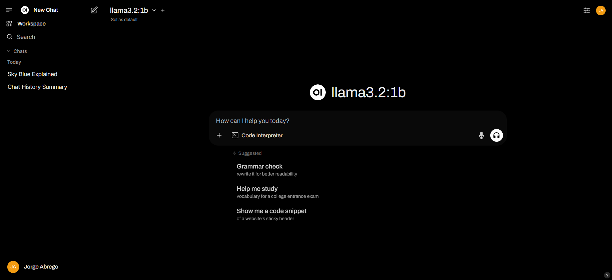

## Running Ollama Third-Party Service

### Choosing a Model

You can get models that Ollama can launch from the [Ollama Library](https://ollama.com/library).

### Getting the Host IP

#### Linux

Get your IP address:
```sh
sudo apt install net-tools
ifconfig
```

Or you can use the following command:
```sh
HOST_IP=$(hostname -I | awk '{print $1}')
```

To start the service:
```sh
HOST_IP=$(hostname -I | awk '{print $1}') NO_PROXY=localhost LLM_ENDPOINT_PORT=9000 LLM_MODEL_ID="llama3.2:1b" docker compose up
```

### Ollama API

Once the Ollama server is running, you can make API calls to the Ollama API:

[Ollama API Documentation](https://github.com/ollama/ollama/blob/main/docs/api.md)

### Checking if Ollama is Running

You can check if the Ollama server is up by running:
```sh
curl http://localhost:11434/api/tags
```

## Download (Pull) a Model

To pull a model into Ollama, you can do it in two ways: by connecting to the Ollama server and running the pull command, or through the API.

### Using the Pull Command
```sh
docker exec -it ollama-server ollama run llama3.2:1b
```

### Using the API
```sh
curl -X POST http://localhost:8008/api/pull -H "Content-Type: application/json" -d '{
  "model": "llama3.2:1b"
}'
```

## Generating a Request

To generate a request using the API:
```sh
curl -X POST http://localhost:11434/api/generate -H "Content-Type: application/json" -d '{
  "model": "llama3.2:1b",
  "prompt": "Why is the sky blue?"
}'
```

## Using Models with Open WebUI

If you want to test models in Ollama, you can use Open WebUI.



# Technical Uncertainty

Q Does bridge mode mean we can only accses Ollama API with another model in the docker compose?

A No, the host machine will be able to access it

Q: Which port is being mapped 8008->141414

In this case 8008 is the port that host machine will access. the other other in the guest port (the port of the service inside container)

Q: If we pass the LLM_MODEL_Id to the ollama server will it download the model when on start?

It does not appear so. The ollama CLI might be running multiple APIs so you need to call the /pull api before trying to generat text

Q: Will the model be downloaded in the container? does that mean the ml model will be deleted when the container stops running?

A: The model will download into the container, and vanish when the container stop running. You need to mount a local drive and there is probably more work to be done.

Q: For LLM service which can text-generation it suggets it will only work with TGI/vLLM and all you have to do is have it running. Does TGI and vLLM have a stardarized API or is there code to detect which one is running? Do we have to really use Xeon or Guadi processor?

vLLM, TGI (Text Generation Inference), and Ollama all offer APIs with OpenAI compatibility, so in theory they should be interchangable.